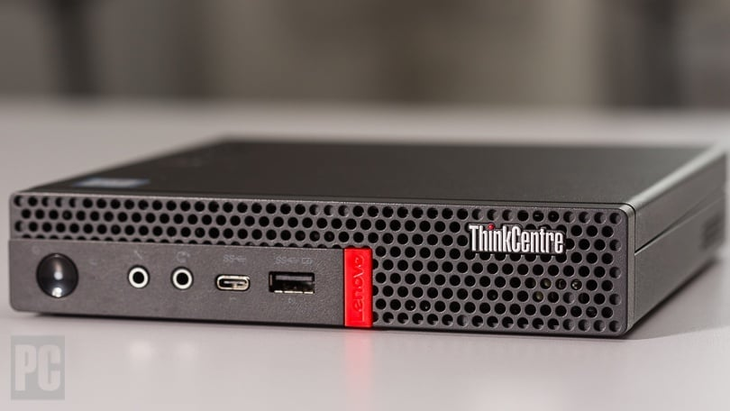
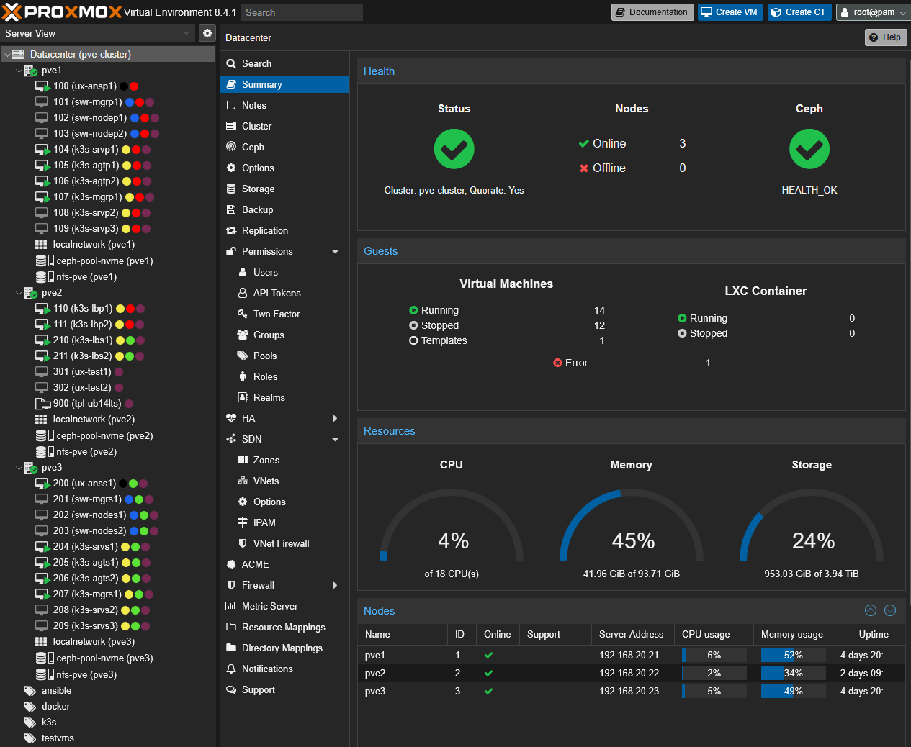

# Homelab configuration:

I am running 3-node HA Proxmox cluster that is running K3s clusters (Production and Staging).

All Linux machines, building Kubernetes K3s (HA or single node cluster), K3s agents join, starships terminal setup and few more bits and bobs are fully automated with **Ansible**.

My goal is to use GitOps approach and practices when working with Kubernetes and have everything automated and stored in GitHub.

## Hardware:

- 3x Lenovo ThinkCentre M720Q
    - 6 x Intel(R) Core(TM) i5-8500T CPU @ 2.10GHz (1 Socket)
    - 32 GB RAM
    - 1 TB SSD

## Proxmox Virtual Environment

---
## More details:

https://github.com/rtdevx/homelab/tree/main/ansible/site#readme

---