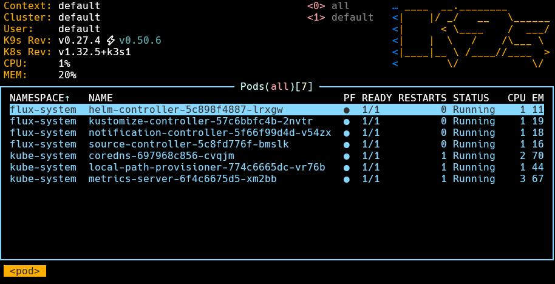
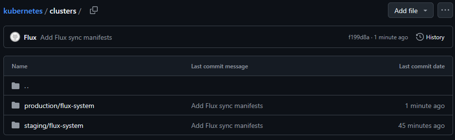

---

 This playbook will install Load Balancer (HAProxy) for K3s User to connect to the Control Plane Server Nodes as well as all the Server and Agent nodes and it will build the K3s cluster.
 
 It will also configure the manager server to allow connectivity from K3s User location to the Load Balancer (left side on below diagram).

 External Traffic to PODS will be managed via Kubernetes.

 
 
 ---

Script can install and configure 1-node OR 3-node HA K3s cluster with 2 LB's in front.
If for any reason descaling or removing nodes is required:

### 1. Removing Server nodes

```bash
kubectl drain NODENAME --delete-emptydir-data --ignore-daemonsets

kubectl delete node NODENAME

sudo /usr/local/bin/k3s-uninstall.sh && sudo rm -rf /etc/rancher
```

### 2. Removing Agent nodes

```bash
kubectl drain NODENAME --delete-emptydir-data --ignore-daemonsets

kubectl delete node NODENAME

sudo /usr/local/bin/k3s-agent-uninstall.sh && sudo rm -rf /etc/rancher
```

## Ansible script modifications for 1-node OR 3-node scenario

I still keep 2 LB's in front for flexibility and so Control Plane Servers can be added in the future. This is to ensure K3s cluster scaling out can be done quickly.

Configuration items in the script needed changing depending on the scenario:

 1. Comment or comment out Server Nodes from inventory (group k3ssvr).
 2. Update _main.yml_ in _k3s_configure_haproxy_ role. Select (uncomment) the relevant role depending on the scenario (HA or Single node).
 3. `rm -rf /etc/haproxy/haproxy.cfg` to ensure fresh file gets copied and updated accordingly.
 4. Run the playbook.

 # Configure GitOps

 I am using Flux as a GitOps workflow to connect to GitHub in order to facilitate the GitOps reconciliation loop.

 Ansible will install Flux binaries and copy necessary SSH keys to allow GitHub connectivity.

#### `More: configure_k8s.yml`

 Note Flux is installed on the Manager node, not on the Cluster itself (refer to _K3s User_ in the above diagram).

 Manual steps are required after playbook installed the binaries and copied SSH keys in order to initiate Flux and connect to GitHub.

 A good set of instructions is here:

https://fluxcd.io/flux/get-started/

https://fluxcd.io/flux/installation/

https://fluxcd.io/flux/installation/bootstrap/github/

I am using 2 environments (production and staging) and 2 branches (main and staging) in order to manage Kubernetes clusters.

Here are my commands to run in order to initialize (bootstrap) the Flux controller:

### Staging

```bash
sudo su - k3s

flux bootstrap git --url=ssh://git@github.com/rtdevx/kubernetes.git --branch=staging --private-key-file=/home/k3s/.ssh/id_rsa_git_k8s --password=<SSH-KEY-PASSWORD> --path=clusters/staging
```

### Main (Production)

```bash
sudo su - k3s

flux bootstrap git --url=ssh://git@github.com/rtdevx/kubernetes.git --branch=main --private-key-file=/home/k3s/.ssh/id_rsa_git_k8s --password=<SSH-KEY-PASSWORD> --path=clusters/production
```

After Flux is initialized, flux-system namespace has been created and you can see additional PODs running in the cluster (helm-controller, kustomize-controller, notification-controller, source-controller).



Note new files appeared in GitGub repository.



---

<h1 style="font-size:3vw;"><p align="center">
<mark>MILESTONE: Kubernetes cluster is now being managed with Git!</mark>
</p>
</h1>
